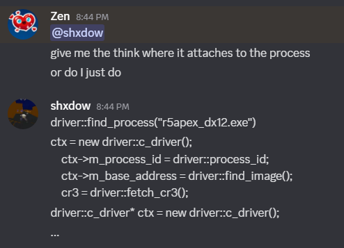
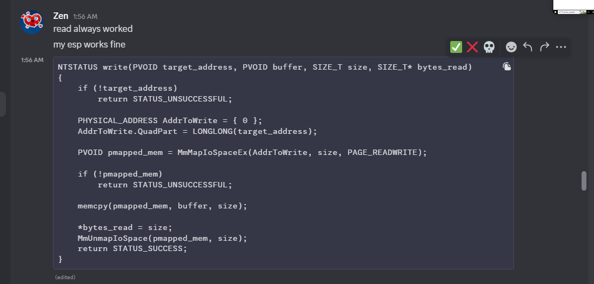

# 🧘‍♂️ Zen — Master of Skidding and Delusion

Another day, another exposed skid. This time it’s **Zen**, the self-proclaimed “dev” who couldn’t code a calculator without StackOverflow and divine intervention.

---

### proof of him being delu lu 

saying updates he did not do and leaching off of drexxys stuff always asking for help and never does anything alone

### 🤡 cant init his driver 🔥
LMFAO

---

### 🗣️ Can't figure out how to debug shit?

---

### 🗣️ Mem aim is ud but you send me NetConnection?

---

### 🧠 Doesn't Understand His Own Codebase  
on his supposed "Self code bases"

---
### pasting from others like (sofmain senex etc..)

### claiming he has super good products "yet dosent use them"

### oh yea dude my products are good yet seeking other people to debug his shit as if he cant just press (ctrl + shift + b)

### not knowing basic windows api knowledge 

### claiming he knows how to "crack" but dosent know simple cracking knowledge

 well no shit sherlock ☠️

### more proof of him claiming he knows things

### i asked him a gibberish question and awnsered with some bullshit

agreeing with me because i said i think i should wich is bulllshit i just mashed keys to something realisitc

### calaiming to have 8k vouches yet needs stuff from 2 small developers?

### dosent know the diffrence between km and um 

### still cant differenciate that not all drivers have the same ctl codes 🤡

### claiming other peoples sources for cheats are his 

for example branding sofmains v3 base branding it zen selling it posting it taking credit for other peoples work using sofmains source for cheats not swapping drivers cause he dosent know how to swap it changing names but hes so stupid keeping the same watermark and menu design cause he dosent know how to swap or change it so instead he clearly used chatgpt to update it cause he has no idea what hes doing ill show sofmains source/menu and show "zens base"

### sofmain pic

### more picture proof 
you can clearly see here there is the same watermark and same bone structure and menu and obviously he dosent know how to gui swap (graphical user interface)

### if he claims that he never said they were his 

### skids again responds to jibberish
  

### 🚫 “Nobody Knows You” Energy  
Tries to act mysterious like it’s 2013 LulzSec, but no one even asked.  

---

### 💀 Summary:  
Zen is what happens when ChatGPT, pastebin, and zero shame come together.  
He’s not a dev — he’s just a drama episode waiting to happen. 

FYI 
dont act all high and mighty or act like you know about devving or cyber sec we will clown on you your not elliot alderson your not prime dedsec your not payson  its ok to be a beginner but never a skid or a script kiddie
