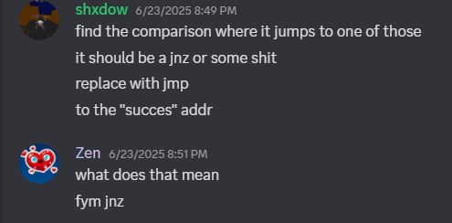

# 🧘‍♂️ Zen — Master of Skidding and Delusion

Another day, another exposed skid. This time it’s **Zen**, the self-proclaimed “dev” who couldn’t code a calculator without StackOverflow and divine intervention.

---

### 🧠 Proof of Delusion  
Claims to push updates he didn’t make. Constantly leeching from Drexxy. Always asking for help — never solo.

---

### 🤡 Can’t Init His Driver  
LMFAO  
  
  

---

### 🪲 Can’t Debug His Own Sh*t  

---

### 🧃 Mem Aim is UD but Sends NetConnection?  

---

### ❌ Doesn’t Understand His Own "Self-Coded" Bases  
  

---

### 📋 Pasting From Other Devs  
Using bases like **Sofmain**, **Senex**, and more.  

---

### 💬 "My Products Are Good" (Yet Doesn’t Use Them)  

---

### 🛠️ Needs Help Debugging Like Ctrl+Shift+B Doesn’t Exist  

---

### 🧑‍💻 Doesn’t Know Basic Windows API  

---

### 🧢 Claims Cracking Knowledge But… Nah  
  
 — well no sh*t Sherlock ☠️

---

### 📣 Claims He Knows Everything  

---

### 🤖 Responds to Gibberish Like It's Real  
Asked him nonsense — he agreed like it made sense.  

> literally just mashed keys, he still agreed.

---

### 🧾 "8K Vouches" But Needs Help from 2 Small Devs?  

---

### 🔌 Doesn’t Know KM vs UM  

---

### 🎯 Thinks All Drivers Use Same CTL Codes  

---

### 🧬 Claims Other Peoples’ Cheat Sources Are His  

Branded **Sofmain V3** as his own and resold it.  
Didn’t even change the watermark or GUI.

- **Zen's Rebrand**  
  

- **Sofmain Original**  
  

- **Identical Structure / Watermark**  
  

---

### 🧾 "I Never Claimed It Was Mine"  

---

### 🤯 Still Responding to Gibberish Like It's Code  

---

### 💀 Summary  

Zen is what you get when ChatGPT, Pastebin, and unchecked overconfidence converge.
He's not a developer — he's a case study in script-kiddie theatrics.

---

### ⚠️ Final Note  

It's OK to be a beginner.  
It's OK to learn and ask questions.  
But it is **NEVER OK** to be a **skid**, it is **NEVER OK** to be a **paster**.

You're not Elliot Alderson. You're not DedSec. You're not Payson.
Pasting and getting yourself exposed is going to ruin your future opportunities.
Don’t fake it — learn it.

