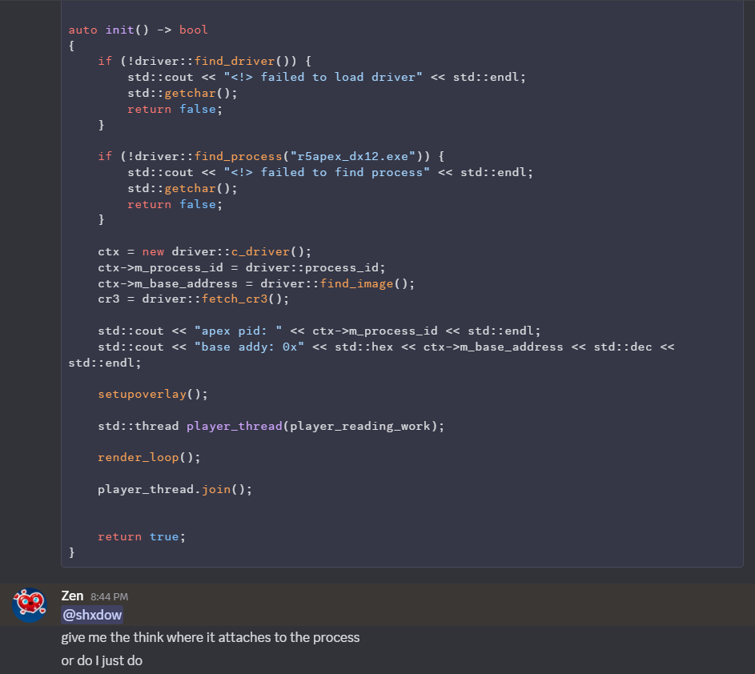
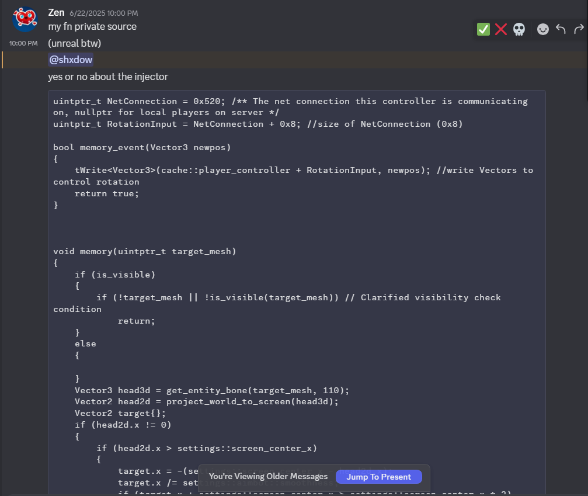
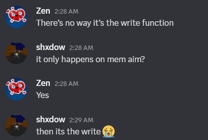

# 🧘‍♂️ Zen — Master of Skidding and Delusion

Another day, another exposed skid. This time it’s **Zen**, the self-proclaimed “dev” who couldn’t code a calculator without StackOverflow and divine intervention.

---

### 🤡 cant init his driver 🔥
LMFAO

---

### 🗣️ Can't figure out how to debug shit?

---

### 🗣️ Mem aim is ud but you send me NetConnection?

---

### 🧠 Doesn't Understand His Own Codebase  
on his supposed "Self code bases"

---

### 🚫 “Nobody Knows You” Energy  
Tries to act mysterious like it’s 2013 LulzSec, but no one even asked.  

---

### 💀 Summary:  
Zen is what happens when ChatGPT, pastebin, and zero shame come together.  
He’s not a dev — he’s just a drama episode waiting to happen.  
